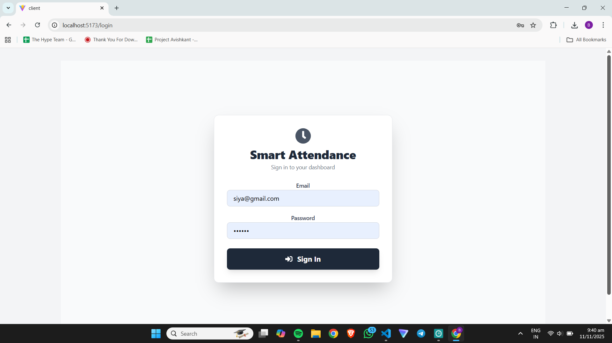
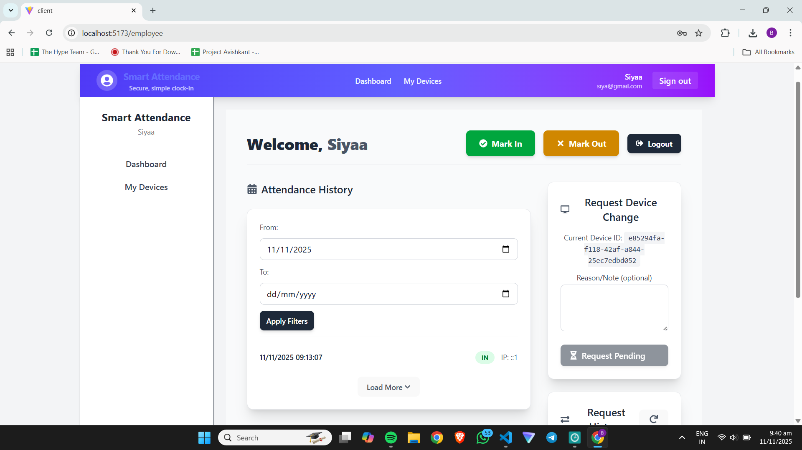
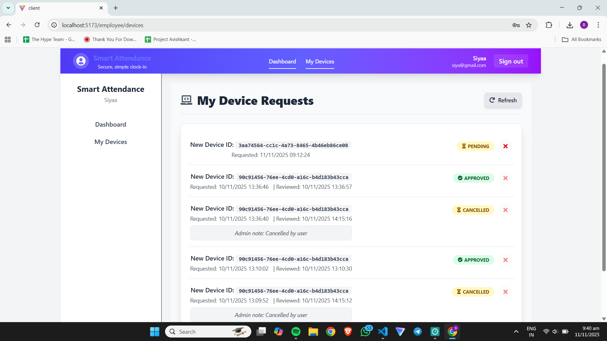
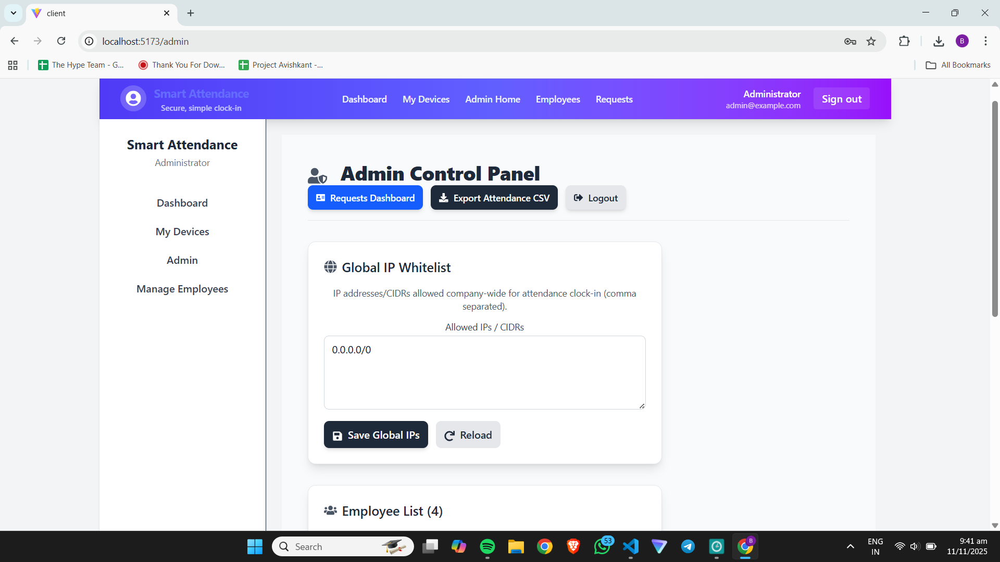
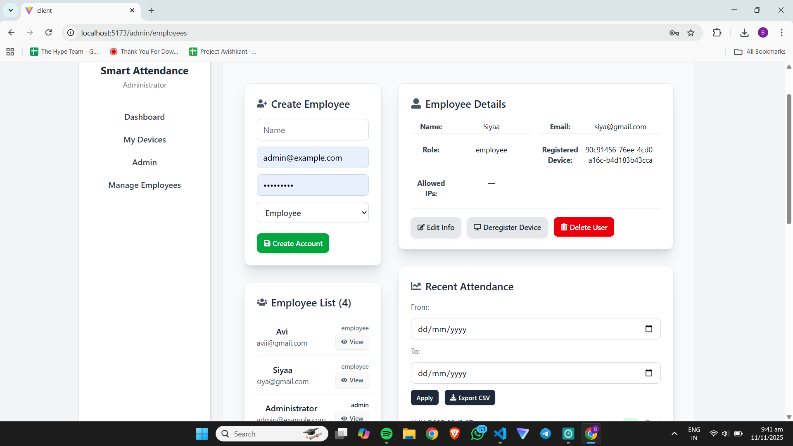
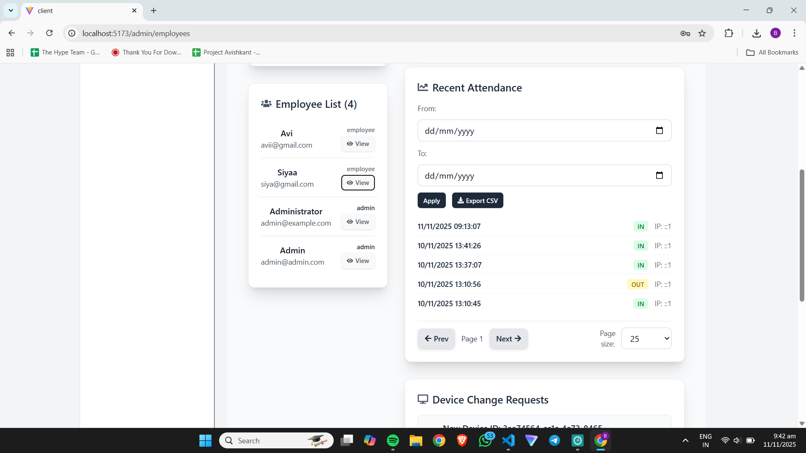
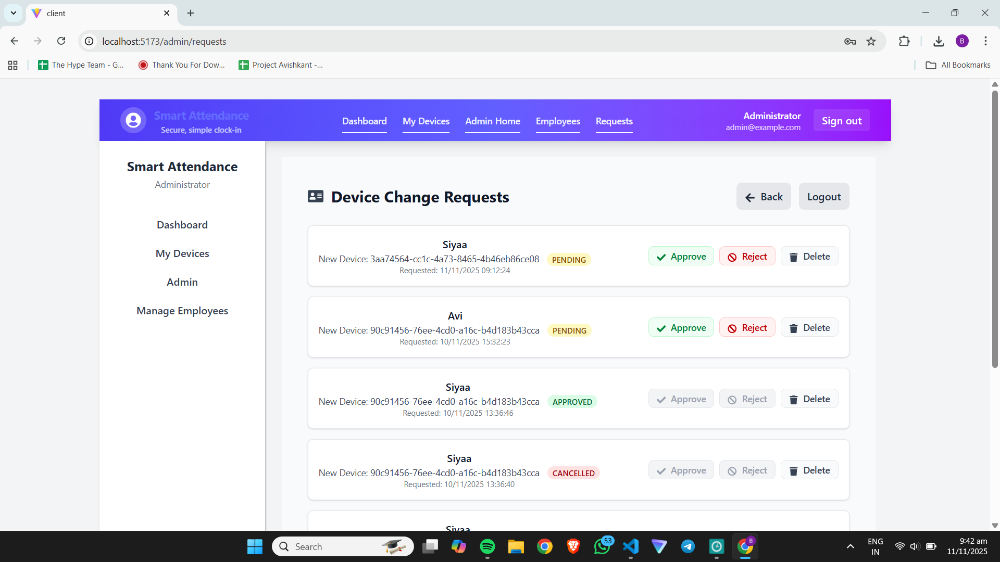

# Smart Attendance — Client

## Short description

Smart Attendance is a secure attendance tracking application. The client is a Vite + React (Tailwind) front-end that communicates with a Node/Express backend to allow employees to mark attendance (In/Out), request device changes, and lets administrators manage employees, approve device requests, and export attendance data.

---















## Full project walkthrough

1. Authentication

- Users sign in on the login page. JWT authentication is performed by the backend. The client stores the token in localStorage and attaches it to API calls.

2. Employee flows

- Dashboard: Employees see their current device status and can mark attendance using the "Mark In" and "Mark Out" buttons. The UI shows recent attendance entries and a small date-range filter inside the attendance card (Apply button is grouped with results).
- My Devices / Request Device Change: Employees can request to change their registered device by providing a note. New requests are blocked if there is an outstanding pending request. When a request is approved by an admin, the device becomes registered to the user.

3. Admin flows

- Admin Control Panel: High-level export and quick actions (CSV export, IP whitelist management, company settings).
- Manage Employees: View employees, their registered device IDs, allowed IPs, and open per-user attendance (date-range only). The per-user attendance view allows admins to select a from/to date and click Apply to fetch results for that user.
- Requests: A dedicated page where admins can see pending device-change requests, inspect notes, and Approve / Reject / Delete requests. Approving a request registers the new device for the user and clears other pending requests.

4. Attendance & date handling

- The client uses native `<input type="date">` elements for date selection. Internally the client converts selected yyyy-mm-dd values to start-of-day and end-of-day ISO datetimes (local timezone) and sends those as `from` and `to` parameters to the server. This ensures same-day selections return records for the whole day.
- If you see off-by-one-day issues, check both client and server timezone handling; the server should filter by the provided ISO datetimes.

5. Pagination & exports

- Attendance endpoints support pagination. The client uses a "Load more" button for long lists. Admins can export CSVs for the selected range or full company data using the export action in the control panel.

## How to run (development)

Prerequisites:

- Node.js 18+ (recommended)
- npm or yarn
- MongoDB (for the server)

Start the server and client in separate terminals (PowerShell examples):

```powershell
cd server
npm install
# create server/.env with MONGODB_URI, PORT, JWT_SECRET etc.
npm run dev
```

```powershell
cd client
npm install
# optional: create client/.env.local and set VITE_API_URL=http://localhost:5000/api
npm run dev
```

Open the URL printed by Vite (usually http://localhost:5173).

Environment variables (client)

- `VITE_API_URL` — base URL for API requests (default: http://localhost:5000/api). Put it in `client/.env.local`.

## Developer notes & known adjustments

- Responsiveness: The app uses Tailwind responsive utilities (e.g., `flex-col lg:flex-row`) for layout. I updated sidebars to hide on small screens and rely on the Navbar mobile menu.
- Error handling: There is an `ErrorBoundary` component that surfaces render-time errors with stack traces in development.


